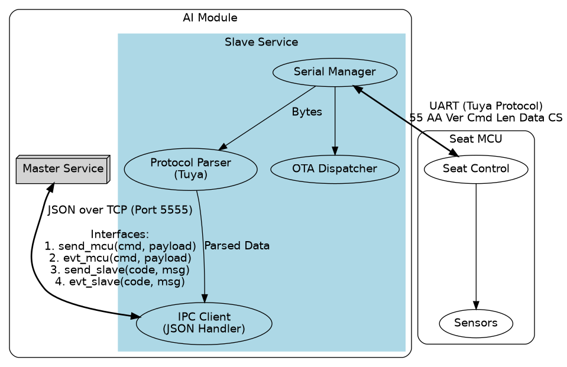
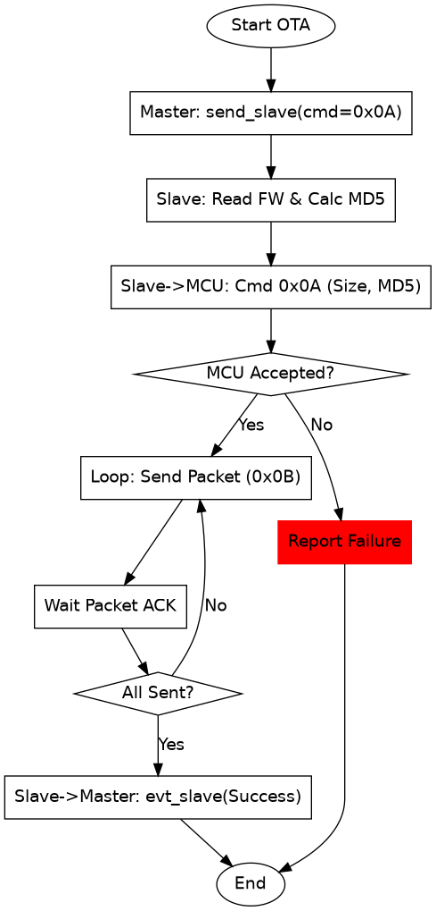

# ProAI 通信协议规范

本文档定义了 AI 模组内部的 **主服务 (Master Service)** 与 **从服务 (Slave Service)** 之间的通信机制，以及底层 **涂鸦串口协议** 的处理分工。

---

## 1. 架构与职责分工

为了保证系统稳定性和实时性，采用了主从分离架构。

| 特性 | 主服务 (Master Service) | 从服务 (Slave Service) |
| :--- | :--- | :--- |
| **语言** | Python / Go / C++ | C |
| **核心职责** | 业务逻辑、云端交互、AI 推理 | 硬件抽象、协议转换、保活、OTA 流程管控 |
| **串口处理** | **不直接操作串口** | **独占管理 /dev/ttySx** |
| **协议感知** | 仅关注业务数据 (如: "开灯") | 处理物理帧 (头、校验、转义) |
| **稳定性** | 可能因业务逻辑复杂而重启 | 极高，作为守护进程常驻 |

---

## 2. 内部通信协议 (IPC)

### 2.1 协议帧格式 (JSON over TCP)

通信采用 Length-Prefixed JSON 格式（大端序），以提高可扩展性：

| 字段 | 长度 | 说明 |
| :--- | :--- | :--- |
| **Length** | 4 Bytes | 后续 JSON 字符串的字节长度 (Big Endian) |
| **JSON** | N Bytes | UTF-8 编码的 JSON 字符串 |

### 2.2 消息类型定义

系统定义了 4 种核心接口，分为两类：
1. **透传类**: 用于 Master 与 MCU 之间的业务数据交互，Slave 仅做协议封装/解封装。
2. **控制类**: 用于 Master 与 Slave 之间的直接交互（如状态上报、OTA 触发）。

| 接口类型 | Type | 方向 | 说明 | Data 结构 | 示例 |
| :--- | :--- | :--- | :--- | :--- | :--- |
| **透传类** | `send_mcu` | Master->Slave | 发送串口指令 | `cmd` (int), `payload` (string) | `{"cmd": 6, "payload": "0101"}` |
| **透传类** | `evt_mcu` | Slave->Master | MCU 数据上报 | `cmd` (int), `payload` (string) | `{"cmd": 7, "payload": "00"}` |
| **控制类** | `send_slave` | Master->Slave | 控制从服务 | `cmd` (int), `payload` (any) | `{"cmd": 10, "payload": "start_ota"}` |
| **控制类** | `evt_slave` | Slave->Master | 从服务状态上报 | `code` (int), `msg` (string) | `{"code": 1, "msg": "UART Error"}` |

---

## 3. 底层串口协议参考 (Tuya)

本节列举了支持的涂鸦串口协议指令。

### 7. 基础服务
| Cmd ID | 功能 | 说明 |
| :--- | :--- | :--- |
| `0x00` | 心跳检测 | 定期发送 |
| `0x01` | 查询产品信息 | 获取 PID、版本等 |
| `0x02` | 工作模式 | 配合处理/自处理 |
| `0x03` | 联网状态 | 报告模组联网状态 |
| `0x04` | 模组重置 | 解绑 |

### 8. DP 服务 (数据点)
| Cmd ID | 功能 | 说明 |
| :--- | :--- | :--- |
| `0x06` | 命令下发 | Master -> MCU (控制设备) |
| `0x07` | 状态上报 | MCU -> Master (状态变化) |
| `0x08` | 状态查询 | Master -> MCU (主动查询) |

### 9. MCU 升级服务 (OTA)
**注：OTA 流程由 Slave Service 托管，Master 仅需发送启动指令。**

| Cmd ID | 功能 | 说明 |
| :--- | :--- | :--- |
| `0x0A` | 升级启动 | 通知 MCU 固件大小/MD5 |
| `0x0B` | 升级包传输 | 分包发送固件数据 |
| `0x09` | 升级状态通知 | 查询/通知结果 |

#### 9.1 升级时序图

